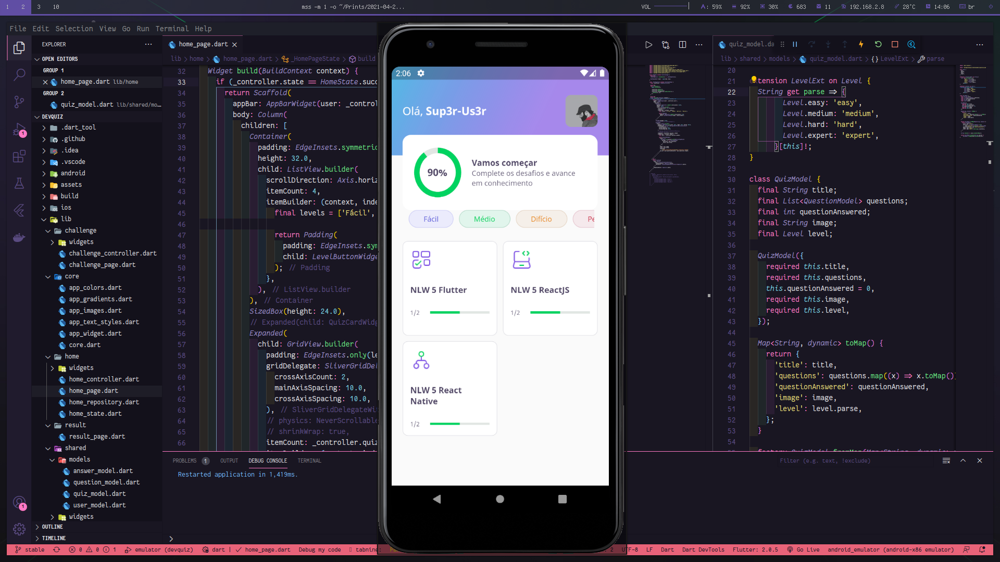

<h1 align="center">
  
</h1>

<p align="center">
  <a href="#-technologies">Technologies</a>&nbsp;&nbsp;&nbsp;|&nbsp;&nbsp;&nbsp;
  <a href="#-project">Project</a>&nbsp;&nbsp;&nbsp;|&nbsp;&nbsp;&nbsp;
  <a href="#-layout">Layout</a>&nbsp;&nbsp;&nbsp;|&nbsp;&nbsp;&nbsp;
  <a href="#memo-license">License</a>
</p>

<br>

<p align="center">
  
</p>

## 🚀 Technologies

This project was developed with the following technologies:

- [Flutter](http://flutter.dev)

## 💻 Project

DevQuiz is an application developed with Flutter, to answer a quiz of questions related to the technologies of this framework.

## 🔖 Layout

In the links below you will find the layout of this project.

- [Layout DevQuiz](https://www.figma.com/file/YU5SCTC0Fkid2LN1jcNO5i/DevQuiz)

## Getting Started

First, install all dependencies and run app with your emulator:

```bash
# Install dependencies
flutter pub get

# Run app
flutter run -d emulator-5554
```
> emulator-5554 is a example, get name of your emulator with command: flutter devices

## :memo: License

This project is under the MIT license. See the file [LICENSE](LICENSE) for more details.
